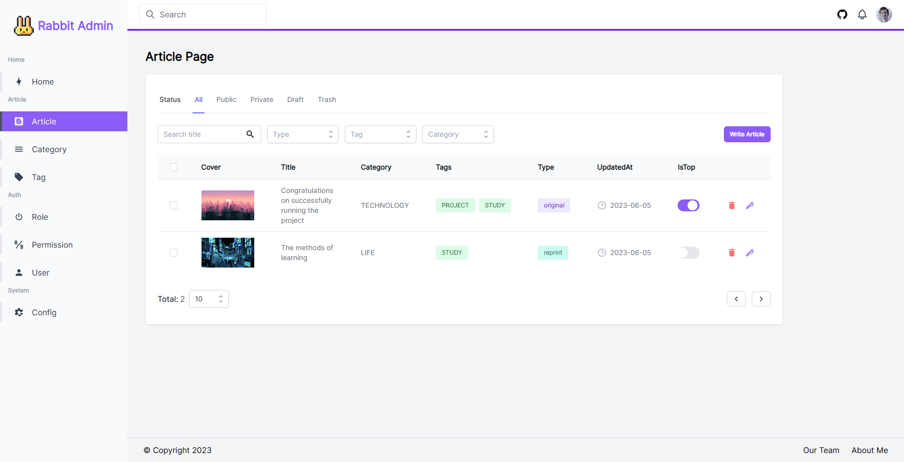
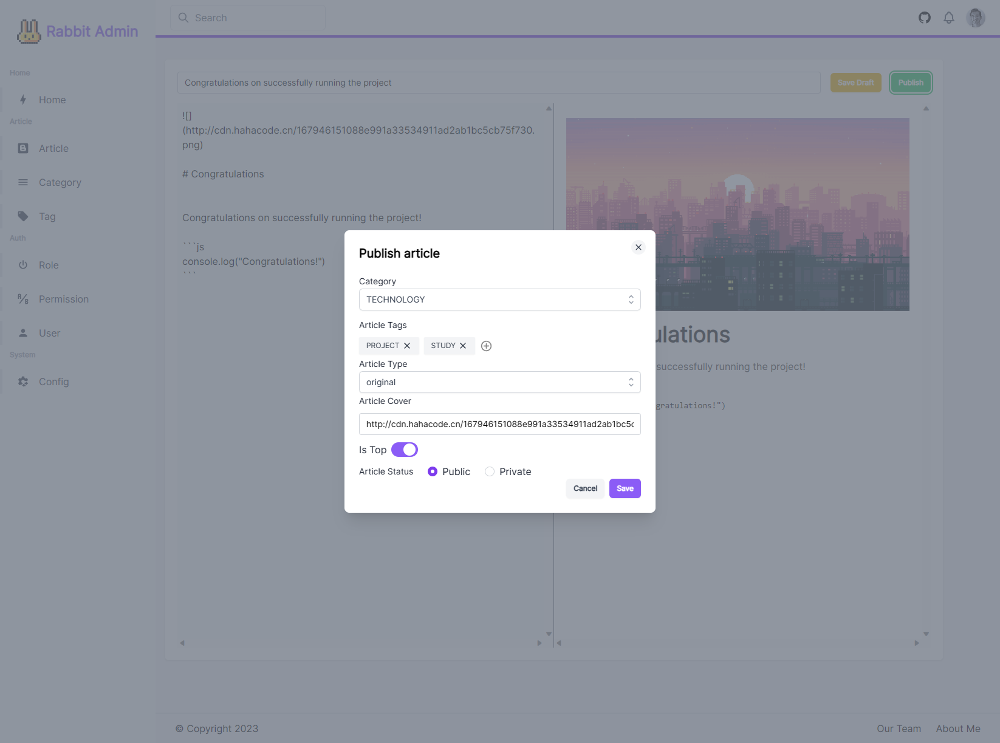
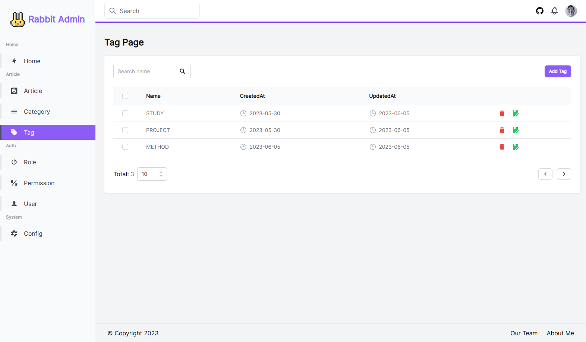
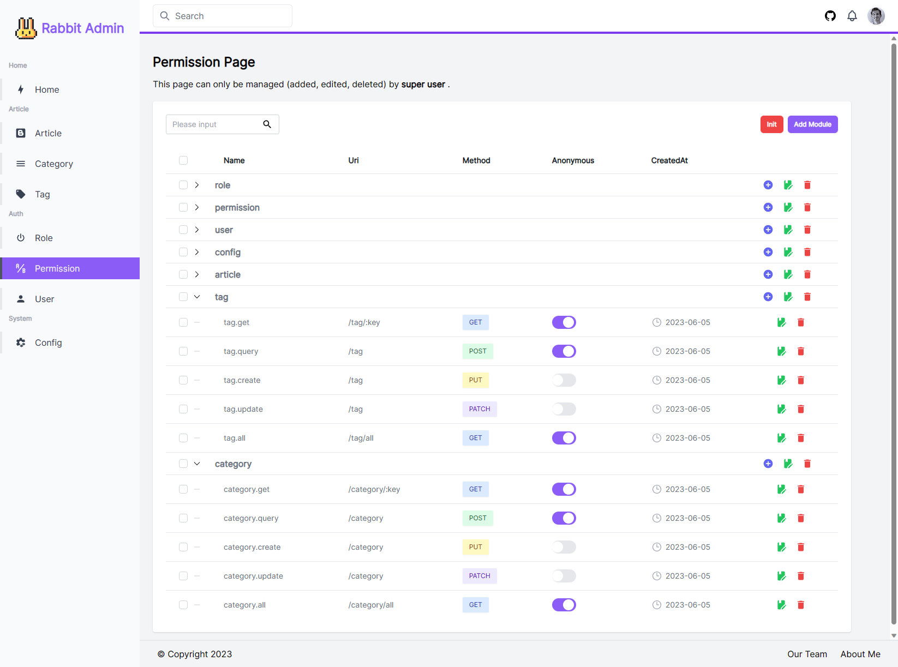
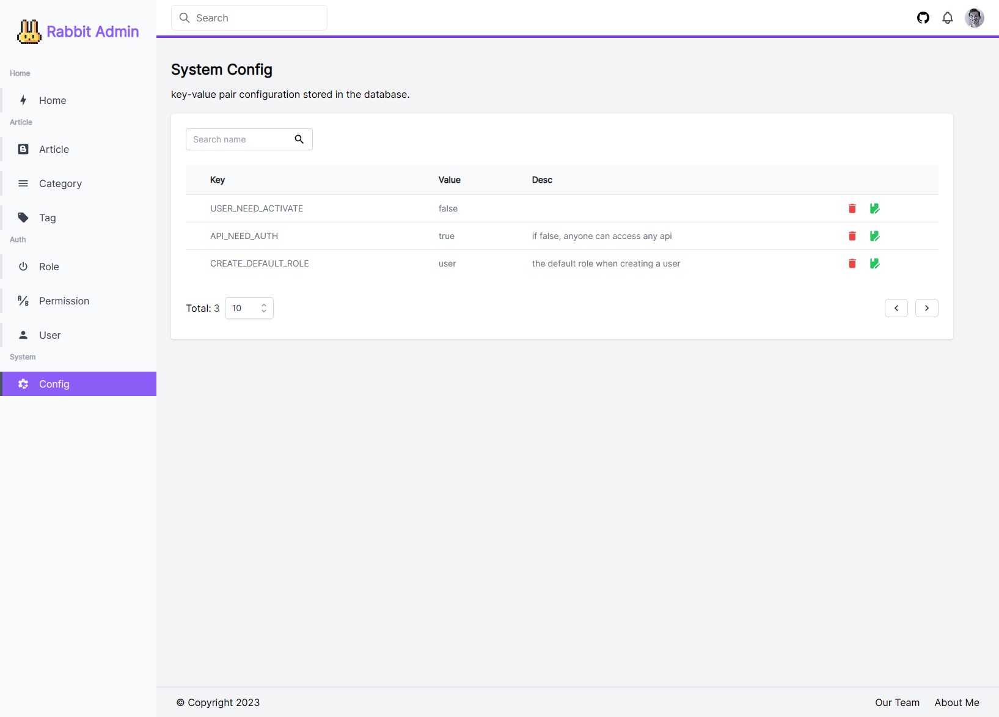

# Rabbit Admin

English | [简体中文](./README-CN.md)

Rabbit Admin is a backend management template based on Golang and Vue3.

In addition to the basic technology stack, it is mainly based on the author's other open source projects:
- The frontend component library uses [unocss-ui](https://github.com/cherryful/unocss-ui)
- The backend framework is based on the scaffold [rabbit](https://github.com/szluyu99/rabbit)

> At present, the backend scaffolding is not yet stable, and I am still considering the design of certain modules.

## Preview











## Technology Stack

Frontend technology stack:
- [Vue3](https://vuejs.org/) + [Vue Router](https://router.vuejs.org/) + [Pinia](https://pinia.vuejs.org/) + [VueUse](https://vueuse.org/)
- [UnoCSS](https://github.com/unocss/unocss) + [UnoCSS UI](https://github.com/cherryful/unocss-ui) 
- [Eslint](https://eslint.org/) + [@antfu/eslint-config](https://github.com/antfu/eslint-config)，不使用 Prettier

Backend technology stack:
- [Gin](https://gin-gonic.com/) + [Gorm](https://gorm.io/)
- [Rabbit](https://github.com/szluyu99/rabbit)

## Quick Start

Run the backend project:

```bash
git clone https://github.com/szluyu99/rabbit-admin.git

cd rabbit-admin/cmd
```

```bash
# MySQL
# Create the database rabbit_admin
go run . -d mysql -n "root:123456@tcp(127.0.0.1:3306)/rabbit_admin?charset=utf8mb4&parseTime=True&loc=Local"

# Sqlite
# No other actions are required
go run . -d sqlite -n "rabbit_admin.db"
```
> You can directly run the `run_mysql.sh` or `run_sqlite.sh` file.

After running the backend project, create a super administrator account: admin@test.com, 123456

```bash
# MySQL
go run . -d mysql -n "root:123456@tcp(127.0.0.1:3306)/rabbit_admin?charset=utf8mb4&parseTime=True&loc=Local" -superuser admin@test.com  -password 123456

# Sqlite
go run . -d sqlite -n "rabbit_admin.db" -superuser admin@test.com -password 123456
```

> You can directly run the `createsuper_mysql.sh` or `createsuper_sqlite.sh` file.

---

Run the frontend project:

```bash
cd rabbit-admin/web
```

```bash
npm install -g pnpm
pnpm install
pnpm run dev
```

Visit [http://localhost:5173](http://localhost:5173)

## Instructions

## Instructions

By default, only the super administrator user can manage the permission module.

After logging in with the super administrator account, you can create roles on the Role page, assign permissions to roles on the Permission page, and finally assign roles to users on the User page (or set the default role when creating a user on the Config page).

1. Run the project and create a super administrator account, then log in to the system.

2. Go to the Permission page and click the initialize button to initialize default permissions.

3. Go to the Role page and click the initialize button to initialize three default roles: admin, user, test. 
- You can then assign permissions to roles and also assign roles to users on the User page.

4. Go to the Config page to view the project's default configuration:
- USER_NEED_ACTIVATE: whether users need to be activated
- API_NEED_AUTH: whether APIs need to be authenticated. If set to false, all APIs do not require authentication.
- CREATE_DEFAULT_ROLE: the name of the default role when creating a user, which needs to exist in Role.

> If using MySQL, you can directly import the `rabbit_admin.sql`.